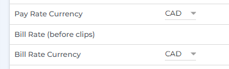

So, you've been tasked with creating a Bullhorn integration, and you need
to look at placements and get the placement fees to power up your new sales 
gamification platform, which is going to revolutionise the recruitment industry? 

No problem you say, I've been building integrations for years. How hard 
can it be...?

Well, one of the first things you will notice is that Bullhorn is 
completely currency agnostic. Despite the fact it is full of 
financial data, none of that financial data has a currency attached. 

In fact, it's a bit worse than that as, most of the time, it does have some 
currency data but it is nestling in one of the 70 (SEVENTY!) custom text 
fields you can find on any placement.

## That's concerning... so what do I do?

The first thing you need to do is scan Bullhorn to look for currency data. 
The Bullhorn API does support this, but you will **need to specify 
all of the custom fields** when querying.

```
GET /query/Placement?count=200&start=0
&fields=customText1,customText2,customText3,customText4,
customText5,customText6,customText7,customText8,customText9,customText10,customText11,
customText12,customText13,customText14,customText15,customText16,customText17,
customText18,customText19,customText20,customText21,customText22,customText23,
customText24,customText25,customText26,customText27,customText28,customText29,
customText30,customText31,customText32,customText33,customText34,customText35,
customText36,customText37,customText38,customText39,customText40,customText41,
customText42,customText43,customText44,customText45,customText46,customText47,
customText48,customText49,customText50,customText51,customText52,customText53,
customText54,customText55,customText56,customText57,customText58,customText59,
customText60,correlatedCustomText1,correlatedCustomText2,correlatedCustomText3,
correlatedCustomText4,correlatedCustomText5,correlatedCustomText6,correlatedCustomText7,
correlatedCustomText8,correlatedCustomText9,correlatedCustomText10
&where=dateAdded > 1704067200000
```

Yup... 😬

This will return a page of 200 placements and all the custom text fields for each.
Now, _IF_ you are lucky all the clients for your awesome new recruitment platform 
will use ISO currency codes. However, we have seen the following variations:

- "pound"
- "£"
- "£ pound"

And many other variations across different currencies.

We've even seen those variations within a single account! At the end of the 
day it is often down to individual recruitment consultants to populate this 
data, so the general rule of thumb is **expect the unexpected**.

Hopefully, they will also consistently use the same custom text field for currency, but 
again you may want to prepare yourself to handle that.

## What about Bullhorn One?

We'll be following this up with a further post about Bullhorn One, getting into some 
of the specific challenges with those integrations. However, regarding currencies 
specifically, there is something you need to be aware of 🚩. **The currencies you 
will see on Bullhorn One entities are incorrect and not to be trusted**.

Don't be drawn in by these tempting-looking properties when retrieving charges and 
timesheets:

```json
"currencyUnit": {
    "id": 166,
    "alphabeticCode": "USD",
    "name": "US Dollar"
},
```

While you probably can assume the majority of Bullhorn One customers are going to be 
trading exclusively in USD you will need to check that on a case-by-case basis.

If you do find you have a customer that needs to support currencies other than USD 
then, unfortunately,you will need to repeat the earlier scan of custom fields. 
This time you are likely looking for two currencies: pay rate currency and 
bill rate currency. Most of the financial data in Bullhorn One you will retrieve 
from billable charges and payable charges, hence the need to look up two currencies.

Now, assuming your customer is using `customText22` and `customText23` as their two 
currencies, how do you know which is for pay and which is for bill? In classic fashion, 
that also is not easy 😅

In the UI it will probably appear something like the below, but remember these are 
just relabelled custom fields.



So how do you find out which fields have been relabelled?

There is a request you can make which may reveal the labelling for you. You will need 
to get hold of a specific Placement ID and then hit the following.

```
GET /entity/Placement/:PlacementId?layout=ProfileRightSideBar&meta=track&showReadOnly=true
```

This is a request which is made when rendering the Bullhorn UI and may include the 
field you are looking for. The returned objects look like:

```json
[
    {
        "name": "customText22",
        ...
        "label": "Pay Rate Currency",
        ...
    },
    {
        "name": "customText23",
        ...  
        "label": "Bill Rate Currency",
        ...
    }
]
```

So, we can see in this example that it is actually `customText22` which has been 
designated as the pay rate currency and `customText23` contains the billing currency. 
We did say it wasn't straightforward! 😩

## Final thoughts

The currency agnostic nature of Bullhorn and its US-centric nature make any 
multi-currency setup more challenging to support than it should be. However, using 
the steps above you can at least make a fist of it. Good luck 🍀