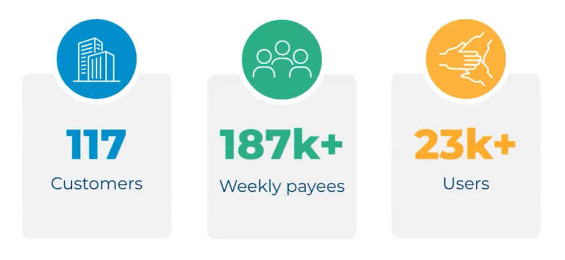

So you've been tasked with creating a Bullhorn One integration, and you're staring at the long list of endpoints and 
wondering where to get started? Well, fear not, as we've been exactly where you are and we're hear to shed some light 
on how Bullhorn One hangs together.

If you're not already aware, Bullhorn One is Bullhorn's middle office system for North America. It's still relatively 
early days, but the last published adoption statistics (at the time of writing) show that many of Bullhorn's biggest 
customers are on there.

With an average of 200+ users per account, it is well worth your time considering a Bullhorn One integration!

If you already have a Bullhorn integration, then I have good news for you as you are accessing the same API with the 
same authentication mechanisms, so you won't need to reinvent the wheel there. If not, then stay tuned for our future 
post on authenticating with Bullhorn.

